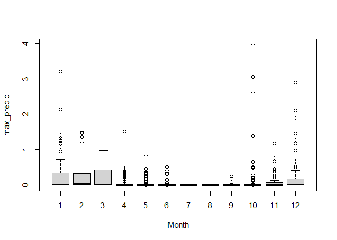

```r
library(tidyverse)
library(data.table)
library(xts)
```

```
## Warning: package 'xts' was built under R version 4.0.4
```

```r
library(sf)
library(here)
library(readxl)
library(RColorBrewer)
library(zoo)
library(lubridate)
library(ggplot2)
```
## Load Data

### Precipitation

In October 2020, Steven Eikenbary created a 4x4km grid of the SF delta study area in ArcMap, and retrieved the lat/longs of the center points in each grid. Those coordinates can be found at:

URL

On October 26, 2020, precipitation data was downloaded from PRISM for that grid of coordinates (n=33) using the multiple sites downloader: https://prism.oregonstate.edu/explorer/bulk.php

Data were downloaded for every water year between 2009 through 2019, for all locations within the grid.

The spatial resolution of the data is 4km, and it was sourced from the AN81d dataset. Precipitation includes rainfall + melted snowfall. Additional details about the data can be found at: http://www.prism.oregonstate.edu/documents/PRISM_datasets.pdf


<br/>


### USFE Risk Regions

```r
# Load Risk Regions from GitHub CEDEN repository (change if moved)

USFE.RiskRegions.z <- "https://github.com/WWU-IETC-R-Collab/CEDEN-mod/raw/main/Data/USFE_RiskRegions_9292020.zip"

unzip_shape <- function(InputShapeZip){
  dl.temp <- tempfile() # Create local temp file for zipped shapefile
  dl.temp2 <- tempfile() # Create a second local temp file to store unzipped shapefile
  download.file(InputShapeZip, dl.temp, quiet=T) # Downloads zip file from InputShape
  unzip(zip = dl.temp, exdir = dl.temp2) # Unzips zip file
  shapefile.out <-list.files(dl.temp2, pattern = ".shp$",full.names=TRUE) # stores file path of files with .shp ext in dl.temp2
  sf::st_read(shapefile.out) # Reads shapefile as sf object
}

USFE.RiskRegions <- unzip_shape(USFE.RiskRegions.z) # CRS is WGS 84
```

```
## Reading layer `RiskRegions_DWSC_Update_9292020' from data source `C:\Users\Erika\AppData\Local\Temp\RtmpsnhjXc\file2c1c44631e6\RiskRegions_DWSC_Update_9292020.shp' using driver `ESRI Shapefile'
## Simple feature collection with 6 features and 6 fields
## geometry type:  POLYGON
## dimension:      XYZ
## bbox:           xmin: -122.1431 ymin: 37.62499 xmax: -121.1967 ymax: 38.58916
## z_range:        zmin: 0 zmax: 0
## geographic CRS: WGS 84
```

<br/>

### CEDENSURF

I have read in the combined modified CEDEN and SURF data, but I believe that it may be most useful to jump right to the wide format data...


```r
CEDENSURFMod <- fread("https://github.com/WWU-IETC-R-Collab/CEDENSURF-mod/raw/main/Data/Output/CEDENSURFMod.csv")
```

<br/>
<br/>

## Data Prep

1. Combine water years
2. Make shapefile
3. Join to risk regions
4. Summarize precipitation by risk region
*Steven had summarised precip using MAX - why not mean?*


```r
## Combine data

AllWY <- rbind(df2010, df2011, df2012, df2013,
               df2014, df2015, df2016, df2017,
               df2018, df2019)

rm(df2010, df2011, df2012, df2013,
   df2014, df2015, df2016,df2017,
   df2018, df2019) # clean up global environment

## Modify data

AllWY<- AllWY %>%
  mutate_if(is.integer, as.numeric) %>%
  mutate(Date = as.Date(AllWY$Date, "%m/%d/%Y")) %>%
  filter(!is.na(Date))

## Create zoo

AllWY.zoo <-zoo(AllWY, as.Date(AllWY$Date))

## Create sf

AllWY.sf <- st_as_sf(AllWY, coords = c("Longitude", "Latitude"), remove = F, crs = "WGS84")

## Join to Risk Regions

AllWY.sf <- st_join(AllWY.sf, USFE.RiskRegions[1], left = T) %>%
  filter(!is.na(Subregion)) 

AllWY <- AllWY.sf %>% st_set_geometry(NULL)
```


```r
## Summarize precip by dates within each RR.
AllWY_max <- AllWY %>%
  group_by(Date, Subregion, WaterYear) %>%
  summarize(max_precip = max(ppt_in))
```

## Define Seasons

**What qualifies as the wet season?**

In each region I observed, November - March appeared to be the wettest seasons

According to Alameda WETS tables, during those months

- At the inland edge of the estuary, average monthly precip is only 2.5-3" (< 0.1" per day)

- At the SE border of our study area, average monthly precip is only 1.5 - 2" (<0.07"/day)

*Question what are stronger predictors of water quality parameters?*

Daily water volume definitions
A. Wet being >0.1" in a day *(current)*
B. Wet being >0.2" in a day 

Date buffer definitions
A. 7 days 
B. 3 days *(current)*

**Current process**

Moving forward with Wet being within 7 days of a day with rain event >= 0.1", I added a column to CEDENSURF defining Season


```r
wet_event <- subset(AllWY_max, max_precip >= 0.1)

# Create new DF that expands data 7 days past each measure

oneweek <- wet_event %>% 
  group_by(Date, Subregion) %>% 
  complete(Date = seq.Date((Date), (Date+3), by = 'days'))
```


## Join Seasons to CEDENSURF wide data

First, convert CEDENSURF to wide format. Output will then be ready for case file learning. 

## Example using Water Quality Parameters Subset

```r
WQ_Wide <- fread("https://github.com/WWU-IETC-R-Collab/CEDENSURF-data.splitting/raw/main/Data/Output/WQP.Wide.water.csv")
```


```r
# Join CEDENSURF to AllWY_max

CS_PRISM<- merge(WQ_Wide, AllWY_max[,c("Date", "max_precip", "Subregion", "WaterYear")], by = c("Date", "Subregion"))

# Subset and define wet period

CS_wet <- subset(CS_PRISM, Date %in% oneweek$Date)
CS_wet$Season <- "wet"

# Subset and define dry period

CS_dry <- subset(CS_PRISM, !(Date %in% oneweek$Date))
CS_dry$Season <- "dry"

# Bind back together

CS_PRISM <- rbind(CS_wet, CS_dry)

# Checked before and after subsets/recreation, and total records remains 210208
```

### Explore outcome

Which months ended up with "wet" vs "dry" seasons?


```r
PRISM_SUM <- CS_PRISM %>% select(Date, Season, WaterYear, Subregion, oxygen, temperature, max_precip) %>% mutate(Month = month(Date))

boxplot(max_precip ~ Month, data = PRISM_SUM)
```

<!-- -->

```r
PRISM_SUM %>%
  group_by(Month, Season) %>%
  summarise(n())
```

```
## `summarise()` has grouped output by 'Month'. You can override using the `.groups` argument.
```

```
## # A tibble: 22 x 3
## # Groups:   Month [12]
##    Month Season `n()`
##    <dbl> <chr>  <int>
##  1     1 dry      104
##  2     1 wet      152
##  3     2 dry       84
##  4     2 wet      229
##  5     3 dry       90
##  6     3 wet      203
##  7     4 dry      220
##  8     4 wet      215
##  9     5 dry      348
## 10     5 wet      111
## # ... with 12 more rows
```


## Prepare for NETICA

Values should match how they will appear in NETICA

* Region
* Season
* NA --> *


```r
CS_PRISM <- CS_PRISM %>% 
  mutate(Region = Subregion) %>%
  mutate(Region = str_replace(Region, "Central Delta", "Central")) %>%
  mutate(Region = str_replace(Region, "North Delta", "North")) %>%
  mutate(Region = str_replace(Region, "Sacramento River", "Sacramento")) %>%
  mutate(Region = str_replace(Region, "South Delta", "South")) %>%
  mutate(Region = str_replace(Region, "Suisun Bay", "Suisun"))
```

Remove unnecessary columns


```r
ForNetica <- CS_PRISM %>% select(!c(Subregion, Latitude, Longitude, Date, Matrix, WaterYear))
```

Replace NA with *, which is how Netica deals with NA


```r
ForNetica <- mutate_all(ForNetica, ~replace(., is.na(.), "*"))
```


```r
write.csv(x = ForNetica, file = "Data/Output/WQP_ForNetica.csv", 
          row.names = F)
```

**On a Windows, Netica should be able to use the csv file directly. I found that in order for it to allocate continuously variables appropriately into the designated bins, it needed to be a txt file. Therefore, I opened this csv file and re-saved as a txt prior to learning in Netica.**

