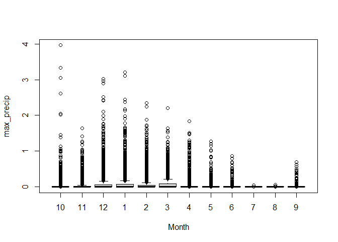
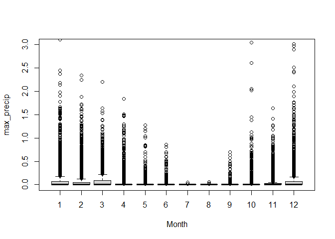

```r
library(tidyverse)
library(data.table)
library(xts)
```

```
## Warning: package 'xts' was built under R version 4.0.4
```

```r
library(sf)
library(here)
library(readxl)
library(RColorBrewer)
library(zoo)
library(lubridate)
library(ggplot2)
```
## Load Data

### Precipitation

In October 2020, Steven Eikenbary created a 4x4km grid of the SF delta study area in ArcMap, and retrieved the lat/longs of the center points in each grid. Those coordinates can be found at:

URL

On October 26, 2020, precipitation data was downloaded from PRISM for that grid of coordinates (n=33) using the multiple sites downloader: https://prism.oregonstate.edu/explorer/bulk.php

Data were downloaded for every water year between 2009 through 2019, for all locations within the grid.

The spatial resolution of the data is 4km, and it was sourced from the AN81d dataset. Precipitation includes rainfall + melted snowfall. Additional details about the data can be found at: http://www.prism.oregonstate.edu/documents/PRISM_datasets.pdf


<br/>


### USFE Risk Regions

```r
# Load Risk Regions from GitHub CEDEN repository (change if moved)

USFE.RiskRegions.z <- "https://github.com/WWU-IETC-R-Collab/CEDEN-mod/raw/main/Data/USFE_RiskRegions_9292020.zip"

unzip_shape <- function(InputShapeZip){
  dl.temp <- tempfile() # Create local temp file for zipped shapefile
  dl.temp2 <- tempfile() # Create a second local temp file to store unzipped shapefile
  download.file(InputShapeZip, dl.temp, quiet=T) # Downloads zip file from InputShape
  unzip(zip = dl.temp, exdir = dl.temp2) # Unzips zip file
  shapefile.out <-list.files(dl.temp2, pattern = ".shp$",full.names=TRUE) # stores file path of files with .shp ext in dl.temp2
  sf::st_read(shapefile.out) # Reads shapefile as sf object
}

USFE.RiskRegions <- unzip_shape(USFE.RiskRegions.z) # CRS is WGS 84
```

```
## Reading layer `RiskRegions_DWSC_Update_9292020' from data source `C:\Users\Erika\AppData\Local\Temp\Rtmpqe6EfM\file15504c4a280\RiskRegions_DWSC_Update_9292020.shp' using driver `ESRI Shapefile'
## Simple feature collection with 6 features and 6 fields
## geometry type:  POLYGON
## dimension:      XYZ
## bbox:           xmin: -122.1431 ymin: 37.62499 xmax: -121.1967 ymax: 38.58916
## z_range:        zmin: 0 zmax: 0
## geographic CRS: WGS 84
```

<br/>

### CEDENSURF

I have read in the combined modified CEDEN and SURF data, but I believe that it may be most useful to jump right to the wide format data...


```r
CEDENSURFMod <- fread("https://github.com/WWU-IETC-R-Collab/CEDENSURF-mod/raw/main/Data/Output/CEDENSURFMod.csv")
```

<br/>
<br/>

## Data Prep

1. Combine water years
2. Make shapefile
3. Join to risk regions
4. Summarize: max precipitation observed within grid by risk region
*Steven had summarised precip using MAX - why not mean?*


```r
## Combine data

AllWY <- rbind(df2010, df2011, df2012, df2013,
               df2014, df2015, df2016, df2017,
               df2018, df2019)

rm(df2010, df2011, df2012, df2013,
   df2014, df2015, df2016,df2017,
   df2018, df2019) # clean up global environment

## Modify data

AllWY<- AllWY %>%
  mutate(Date = as.Date(AllWY$Date, "%m/%d/%Y")) %>%
  filter(!is.na(Date))

## Create zoo

AllWY.zoo <-zoo(AllWY, as.Date(AllWY$Date))

## Create sf

AllWY.sf <- st_as_sf(AllWY, coords = c("Longitude", "Latitude"), remove = F, crs = "WGS84")

## Join to Risk Regions

AllWY.sf <- st_join(AllWY.sf, USFE.RiskRegions[1], left = T) %>%
  filter(!is.na(Subregion)) 

AllWY <- AllWY.sf %>% st_set_geometry(NULL)
```


```r
## Summarize precip by dates within each RR.
AllWY_max <- AllWY %>%
  group_by(Date, Subregion, WaterYear) %>%
  summarize(max_precip = max(ppt_in))
```

## Define Seasons

**What qualifies as the wet season?**

In each region I observed, November - March appeared to be the wettest seasons

According to Alameda WETS tables, during those months

- At the inland edge of the estuary, average monthly precip is only 2.5-3" (< 0.1" per day)

- At the SE border of our study area, average monthly precip is only 1.5 - 2" (<0.07"/day)

*Question: what are stronger predictors of water quality parameters?*

Daily water volume definitions
A. Wet being >0.1" in a day *(current)*
B. Wet being >0.2" in a day 

Date buffer definitions
A. 7 days  *(current)*
B. 3 days

**Current process**

Moving forward with Wet being within 7 days of a day with rain event >= 0.05", I added a column to CEDENSURF defining Season.

By changing Stevens code to be a loop, it allowed wet vs dry season to be defined differently for each region on a given date.


```r
# Subset and define wet period for each region

Region<- unique(AllWY_max$Subregion)

result <- list()

for(i in 1:6){
  m<- AllWY_max %>% filter(Subregion == Region[i])
  
  wet_event <- subset(m, max_precip >= 0.05)

  oneweek <- wet_event %>% 
  group_by(Date) %>% 
  complete(Date = seq.Date((Date), (Date+7), by = 'days'))

  PRISM_wet <- subset(m, Date %in% oneweek$Date)
  PRISM_wet$Season01 <- "wet"
  
  PRISM_dry <- subset(m, !(Date %in% oneweek$Date))
  PRISM_dry$Season01 <- "dry"
  
  result[[i]]<-rbind(PRISM_wet, PRISM_dry)
  }

AllWY_max <- do.call(rbind, result)
```

#### Explore outcome

Which months ended up with "wet" vs "dry" seasons?


```r
AllWY_max <- AllWY_max %>% mutate(Month = month(Date))

boxplot(max_precip ~ Month, data = AllWY_max)
```

<!-- -->

```r
AllWY_max %>% 
  group_by(Month, Season01, Subregion) %>%
  summarize(Subregion = first(Subregion),
            Sum = n()) %>%
  pivot_wider(names_from = Season01,
              names_repair = "check_unique",
              values_from = Sum) # Values to fill columns
```

```
## `summarise()` has grouped output by 'Month', 'Season01'. You can override using the `.groups` argument.
```

```
## # A tibble: 72 x 4
## # Groups:   Month [12]
##    Month Subregion          dry   wet
##    <dbl> <chr>            <int> <int>
##  1     1 Central Delta      113   197
##  2     1 Confluence         122   188
##  3     1 North Delta        119   191
##  4     1 Sacramento River   115   195
##  5     1 South Delta        114   196
##  6     1 Suisun Bay         117   193
##  7     2 Central Delta      104   178
##  8     2 Confluence          99   183
##  9     2 North Delta        107   175
## 10     2 Sacramento River   108   174
## # ... with 62 more rows
```

```r
AllWY_max %>% 
  group_by(Month, Season01) %>%
  summarize(Sum = n()) %>%
  pivot_wider(names_from = Season01,
              names_repair = "check_unique",
              values_from = Sum) # Values to fill columns
```

```
## `summarise()` has grouped output by 'Month'. You can override using the `.groups` argument.
```

```
## # A tibble: 12 x 3
## # Groups:   Month [12]
##    Month   dry   wet
##    <dbl> <int> <int>
##  1     1   700  1160
##  2     2   619  1073
##  3     3   394  1466
##  4     4   563  1237
##  5     5  1194   666
##  6     6  1433   367
##  7     7  1801    59
##  8     8  1852     8
##  9     9  1608   192
## 10    10  1206   654
## 11    11   543  1257
## 12    12   427  1433
```


### Seasons via rolling average

I think that it may make most sense to allow a rolling average to be used to reduce incursions of "dry" season within "wet" seasons and vice versa. 


```r
library(RcppRoll)
```

```
## Warning: package 'RcppRoll' was built under R version 4.0.5
```

```r
Region<- unique(AllWY_max$Subregion)

result <- list()

for(i in 1:6){
  m<- AllWY_max %>% filter(Subregion == Region[i])
  m$d14_precipavg <- roll_mean(m$max_precip, n=14, align = "center", fill = NA)
  result[[i]]<- m
}

AllWY_max <- do.call(rbind, result)
```

Trying this with the same 7 day buffer, we find:


```r
# Subset and define wet period for each region

Region<- unique(AllWY_max$Subregion)

result <- list() # empty list to store iterated results from loop

for(i in 1:6){
  m<- AllWY_max %>% filter(Subregion == Region[i])
  
  wet_event <- subset(m, d14_precipavg >= 0.05)

  oneweek <- wet_event %>% 
  group_by(Date) %>% 
  complete(Date = seq.Date((Date), (Date+7), by = 'days')) # fills 7 days beyond each 'wet' date

  PRISM_wet <- subset(m, Date %in% oneweek$Date)
  PRISM_wet$Seasonr <- "wet"
  
  PRISM_dry <- subset(m, !(Date %in% oneweek$Date))
  PRISM_dry$Seasonr <- "dry"
  
  result[[i]]<-rbind(PRISM_wet, PRISM_dry)
  }

AllWY_max <- do.call(rbind, result) # recombine all 6 result df
```

#### Explore outcome

Which months ended up with "wet" vs "dry" seasons?


```r
AllWY_max <- AllWY_max %>% mutate(Month = month(Date))

boxplot(max_precip ~ Month, data = AllWY_max)
```

<!-- -->

```r
AllWY_max %>% 
  group_by(Month, Seasonr, Subregion) %>%
  summarize(Subregion = first(Subregion),
            Sum = n()) %>%
  pivot_wider(names_from = Seasonr,
              names_repair = "check_unique",
              values_from = Sum) # Values to fill columns
```

```
## `summarise()` has grouped output by 'Month', 'Seasonr'. You can override using the `.groups` argument.
```

```
## # A tibble: 72 x 4
## # Groups:   Month [12]
##    Month Subregion          dry   wet
##    <dbl> <chr>            <int> <int>
##  1     1 Central Delta       96   214
##  2     1 Confluence         100   210
##  3     1 North Delta        109   201
##  4     1 Sacramento River   102   208
##  5     1 South Delta        114   196
##  6     1 Suisun Bay          93   217
##  7     2 Central Delta       68   214
##  8     2 Confluence          63   219
##  9     2 North Delta         68   214
## 10     2 Sacramento River    66   216
## # ... with 62 more rows
```

```r
AllWY_max %>% 
  group_by(Month, Seasonr) %>%
  summarize(Sum = n()) %>%
  pivot_wider(names_from = Seasonr,
              names_repair = "check_unique",
              values_from = Sum) # Values to fill columns
```

```
## `summarise()` has grouped output by 'Month'. You can override using the `.groups` argument.
```

```
## # A tibble: 12 x 3
## # Groups:   Month [12]
##    Month   dry   wet
##    <dbl> <int> <int>
##  1     1   614  1246
##  2     2   406  1286
##  3     3   303  1557
##  4     4   454  1346
##  5     5  1396   464
##  6     6  1548   252
##  7     7  1757   103
##  8     8  1854     6
##  9     9  1704    96
## 10    10  1221   639
## 11    11   704  1096
## 12    12   392  1468
```

## Prepare for NETICA {.tabset}

Tabs below have the following process repeated for three datasets: two files prepared for the final NETICA - one df for water and one df for sediment, and a small subset used to test the format compatibility with Netica.

The process used to prepare the data is:

1. Join Seasons data with the wide format CEDENSURF (created via steps documented in the data-splitting rmd). 

2. Reformat to meet requirements for Netica

    Values should match how they will appear in NETICA
    
    * Region - change to names w/o spaces
    * NA --> *

3. Save as csv, then save-as tab delimited txt file (*.txt)

(Writing directly to txt file does not play nice with Netica... Save as CSV then "save-as" txt)

### Sediment


```r
# Load CEDENSURF Data (wide format)
Sed_Wide <- fread("https://github.com/WWU-IETC-R-Collab/CEDENSURF-mod/raw/main/Data/Output/Allsed.Wide.csv") 
    
# Join CEDENSURF to AllWY_max
CS_PRISM<- merge(Sed_Wide, AllWY_max, by = c("Date", "Subregion"))
```


```r
# Merge with season data

CS_PRISM<- merge(Sed_Wide, AllWY_max, by = c("Date", "Subregion"))

# Rename regions

CS_PRISM <- CS_PRISM %>% 
  mutate(Region = Subregion) %>%
  mutate(Region = str_replace(Region, "Central Delta", "Central")) %>%
  mutate(Region = str_replace(Region, "North Delta", "North")) %>%
  mutate(Region = str_replace(Region, "Sacramento River", "Sacramento")) %>%
  mutate(Region = str_replace(Region, "South Delta", "South")) %>%
  mutate(Region = str_replace(Region, "Suisun Bay", "Suisun"))

# Remove unnecessary columns

ForNetica <- CS_PRISM %>% select(!c(Subregion, Latitude, Longitude, Date, WaterYear, max_precip, d14_precipavg))

# Replace NA with *, which is how Netica deals with NA

ForNetica <- mutate_all(ForNetica, ~replace(., is.na(.), "*"))

# Save

write.csv(x = ForNetica, file = "Data/Output/AllSed_ForNetica.csv", 
          row.names = F)
```

### Water 

```r
## For example using Water Quality Parameters Subset and my limited-mode netica, I used just the WQP.Wide.water dataset:

# Load CEDENSURF Data (wide format)
Water_Wide <- fread("https://github.com/WWU-IETC-R-Collab/CEDENSURF-mod/raw/main/Data/Output/Allwater.Wide.csv") 
    
# Join CEDENSURF to AllWY_max
CS_PRISM<- merge(Water_Wide, AllWY_max, by = c("Date", "Subregion"))
```


```r
# Merge with season data

CS_PRISM<- merge(Water_Wide, AllWY_max, by = c("Date", "Subregion"))

# Rename regions

CS_PRISM <- CS_PRISM %>% 
  mutate(Region = Subregion) %>%
  mutate(Region = str_replace(Region, "Central Delta", "Central")) %>%
  mutate(Region = str_replace(Region, "North Delta", "North")) %>%
  mutate(Region = str_replace(Region, "Sacramento River", "Sacramento")) %>%
  mutate(Region = str_replace(Region, "South Delta", "South")) %>%
  mutate(Region = str_replace(Region, "Suisun Bay", "Suisun"))

# Remove unnecessary columns

ForNetica <- CS_PRISM %>% select(!c(Subregion, Latitude, Longitude, Date, WaterYear, max_precip, d14_precipavg))

# Replace NA with *, which is how Netica deals with NA

ForNetica <- mutate_all(ForNetica, ~replace(., is.na(.), "*"))

# Save

write.csv(x = ForNetica, file = "Data/Output/AllWater_ForNetica.csv", 
          row.names = F)

# Writing directly to txt file does not play nice with Netica... Save as CSV then "save-as" txt

# write.table(x = ForNetica, file = "Data/Output/AllWater_ForNetica.txt", sep = "")
```

### Mini 

```r
## For example using Water Quality Parameters Subset and my limited-mode netica, I used just the WQP.Wide.water dataset:

# Load CEDENSURF Data (wide format)
WQ_Wide <- fread("https://github.com/WWU-IETC-R-Collab/CEDENSURF-mod/raw/main/Data/Output/WideSubsets/WQP.Wide.water.csv") 
    
# Join CEDENSURF to AllWY_max
CS_PRISM<- merge(WQ_Wide, AllWY_max, by = c("Date", "Subregion"))
```


```r
# Merge with season data

CS_PRISM<- merge(WQ_Wide, AllWY_max, by = c("Date", "Subregion"))

# Rename regions

CS_PRISM <- CS_PRISM %>% 
  mutate(Region = Subregion) %>%
  mutate(Region = str_replace(Region, "Central Delta", "Central")) %>%
  mutate(Region = str_replace(Region, "North Delta", "North")) %>%
  mutate(Region = str_replace(Region, "Sacramento River", "Sacramento")) %>%
  mutate(Region = str_replace(Region, "South Delta", "South")) %>%
  mutate(Region = str_replace(Region, "Suisun Bay", "Suisun"))

# Remove unnecessary columns

ForNetica <- CS_PRISM %>% select(!c(Subregion, Latitude, Longitude, Date, WaterYear, max_precip, d14_precipavg))

# Replace NA with *, which is how Netica deals with NA

ForNetica <- mutate_all(ForNetica, ~replace(., is.na(.), "*"))

# Save

write.csv(x = ForNetica, file = "Data/Output/WQP_ForNetica.csv", 
          row.names = F)

# Writing directly to txt file does not play nice with Netica... Save as CSV then "save-as" txt

# write.table(x = ForNetica, file = "Data/Output/WQP_ForNetica.txt", sep = "")
```

**On a Windows, Netica should be able to use the csv file directly. I found that in order for it to allocate continuously variables appropriately into the designated bins (ie: when MANY nodes were in one document), it needed to be a txt file. Re-saving the csv as txt worked fine, I also added code here to write directly to txt. **

