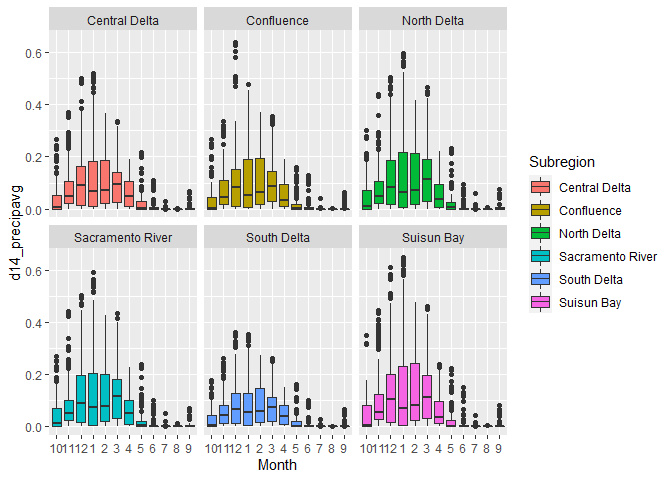

```r
library(tidyverse)
library(data.table)
library(xts)
```

```
## Warning: package 'xts' was built under R version 4.0.4
```

```r
library(sf)
library(here)
library(readxl)
library(RColorBrewer)
library(zoo)
library(lubridate)
library(ggplot2)
```

## Load Data

### Precipitation

In October 2020, Steven Eikenbary created a 4x4km grid of the SF delta study area in ArcMap, and retrieved the lat/longs of the center points in each grid. Those coordinates can be found at:

URL

On October 26, 2020, precipitation data was downloaded from PRISM for that grid of coordinates (n=33) using the multiple sites downloader: https://prism.oregonstate.edu/explorer/bulk.php

Data were downloaded for every water year between 2009 through 2019, for all locations within the grid.

The spatial resolution of the data is 4km, and it was sourced from the AN81d dataset. Precipitation includes rainfall + melted snowfall. Additional details about the data can be found at: http://www.prism.oregonstate.edu/documents/PRISM_datasets.pdf


<br/>

### USFE Risk Regions

```r
# Load Risk Regions from GitHub CEDEN repository (change if moved)

USFE.RiskRegions.z <- "https://github.com/WWU-IETC-R-Collab/CEDEN-mod/raw/main/Data/USFE_RiskRegions_9292020.zip"

unzip_shape <- function(InputShapeZip){
  dl.temp <- tempfile() # Create local temp file for zipped shapefile
  dl.temp2 <- tempfile() # Create a second local temp file to store unzipped shapefile
  download.file(InputShapeZip, dl.temp, quiet=T) # Downloads zip file from InputShape
  unzip(zip = dl.temp, exdir = dl.temp2) # Unzips zip file
  shapefile.out <-list.files(dl.temp2, pattern = ".shp$",full.names=TRUE) # stores file path of files with .shp ext in dl.temp2
  sf::st_read(shapefile.out) # Reads shapefile as sf object
}

USFE.RiskRegions <- unzip_shape(USFE.RiskRegions.z) # CRS is WGS 84
```

```
## Reading layer `RiskRegions_DWSC_Update_9292020' from data source `C:\Users\Erika\AppData\Local\Temp\RtmpI5Ve7T\file119c5adb2d25\RiskRegions_DWSC_Update_9292020.shp' using driver `ESRI Shapefile'
## Simple feature collection with 6 features and 6 fields
## geometry type:  POLYGON
## dimension:      XYZ
## bbox:           xmin: -122.1431 ymin: 37.62499 xmax: -121.1967 ymax: 38.58916
## z_range:        zmin: 0 zmax: 0
## geographic CRS: WGS 84
```

<br/>

## Data Prep

1. Combine water years
2. Make shapefile
3. Join to risk regions
4. Summarize: max precipitation observed within grid by risk region
*Steven had summarised precip using MAX - why not mean?*


```r
## Combine data

AllWY <- rbind(df2010, df2011, df2012, df2013,
               df2014, df2015, df2016, df2017,
               df2018, df2019)

rm(df2010, df2011, df2012, df2013,
   df2014, df2015, df2016,df2017,
   df2018, df2019) # clean up global environment

## Correct Date Format

AllWY<- AllWY %>%
  mutate(Date = as.Date(AllWY$Date, "%m/%d/%Y")) %>%
  filter(!is.na(Date))

## Create zoo

AllWY.zoo <-zoo(AllWY, as.Date(AllWY$Date))

## Create sf

AllWY.sf <- st_as_sf(AllWY, coords = c("Longitude", "Latitude"), remove = F, crs = "WGS84")

## Join to Risk Regions

AllWY.sf <- st_join(AllWY.sf, USFE.RiskRegions[1], left = T) %>%
  filter(!is.na(Subregion)) 

AllWY <- AllWY.sf %>% st_set_geometry(NULL)
```


```r
## Summarize precip by dates within each RR.
AllWY_max <- AllWY %>%
  group_by(Date, Subregion, WaterYear) %>%
  summarize(max_precip = max(ppt_in))

# Add month column
AllWY_max <- AllWY_max %>% mutate(Month = month(Date)) %>%
  mutate(Month = as.factor(Month))

# Clean up workspace
rm(list=setdiff(ls(), c("AllWY_max")))
```

<br/>
<br/>

## Define Seasons

**What qualifies as the wet season?**

In each region I observed, November - March appeared to be the wettest seasons

According to Alameda WETS tables, during those months

- At the inland edge of the estuary, average monthly precip is only 2 - 3" (< 0.06" per day)

- At the SE border of our study area, average monthly precip is only 1 - 2" (<0.03"/day)

*Question: what are stronger predictors of water quality parameters?*

Daily water volume definitions
A. Wet being >0.05" in a day *(current)*
B. Wet being >0.1" in a day 

Date buffer definitions
A. 7 days  *(current)*
B. 3 days

Moving forward with Wet being within 7 days of a day with rain event >= 0.05", I added a column to CEDENSURF defining Season.

By changing Stevens code to be a loop, it allowed wet vs dry season to be defined differently for each region on a given date (since rainfall varies across the region)

### Seasons via rolling average

I think that it may make most sense to allow a rolling average to be used to reduce incursions of "dry" season within "wet" seasons and vice versa.

The following code does three things
1. Calculate a 14-day rolling average (center window) of precipitation within each region
2. Repeat the same 0.05 mm precip definition as a 'wet event', and added the same 7 day buffer to each wet event.


```r
## Create column d14_precip avg holding a 14-day rolling average of max precipitation in the region. 

library(RcppRoll)
```

```
## Warning: package 'RcppRoll' was built under R version 4.0.5
```

```r
Region<- unique(AllWY_max$Subregion)

result <- list()

for(i in 1:6){
  m<- AllWY_max %>% filter(Subregion == Region[i])
  m$d14_precipavg <- roll_mean(m$max_precip, n=14, align = "center", fill = NA)
  result[[i]]<- m
}

AllWY_max <- do.call(rbind, result)

## Subset and define wet period for each region ##

Region<- unique(AllWY_max$Subregion)

result <- list() # empty list to store iterated results from loop

for(i in 1:6){
  # Work within only one region at a time
  m<- AllWY_max %>% filter(Subregion == Region[i])
  
  # Define dates of 'wet' events
  wet_event <- subset(m, d14_precipavg >= 0.05)
  
  # Also define 7 days past each 'wet' event as 'wet'
  oneweek <- wet_event %>% 
  group_by(Date) %>% 
  complete(Date = seq.Date((Date), (Date+7), by = 'days'))
  # Subset those dates from PRISM dataset, and define as "wet"
  PRISM_wet <- subset(m, Date %in% oneweek$Date)
  PRISM_wet$Seasonr <- "wet"
  
  # Subset all other dates from PRISM to define as "dry"
  PRISM_dry <- subset(m, !(Date %in% oneweek$Date))
  PRISM_dry$Seasonr <- "dry"
  
  # Store regional results in a list.
  result[[i]]<-rbind(PRISM_wet, PRISM_dry)
  } # End of loop

AllWY_max <- do.call(rbind, result) # recombine all 6 result df
```


```r
# Preview results

## By Month and Subregion
AllWY_max %>% 
  group_by(Month, Seasonr, Subregion) %>%
  summarize(Subregion = first(Subregion),
            Sum = n()) %>%
  pivot_wider(names_from = Seasonr,
              names_repair = "check_unique",
              # Values to fill columns
              values_from = Sum) %>% 
  mutate(Tot = wet + dry) %>%
  mutate(Perc_Wet = round(wet/Tot*100, 2)) %>% 
  select(!c(wet, dry, Tot))
```

```
## `summarise()` has grouped output by 'Month', 'Seasonr'. You can override using the `.groups` argument.
```

```
## # A tibble: 72 x 3
## # Groups:   Month [12]
##    Month Subregion        Perc_Wet
##    <fct> <chr>               <dbl>
##  1 10    Central Delta        31.9
##  2 10    Confluence           31.6
##  3 10    North Delta          33.2
##  4 10    Sacramento River     33.6
##  5 10    South Delta          26.8
##  6 10    Suisun Bay           32.9
##  7 11    Central Delta        65  
##  8 11    Confluence           58.3
##  9 11    North Delta          67  
## 10 11    Sacramento River     66.3
## # ... with 62 more rows
```

```r
## By Month
AllWY_max %>% 
  group_by(Month, Seasonr) %>%
  summarize(Sum = n()) %>%
  pivot_wider(names_from = Seasonr,
              names_repair = "check_unique",
              # Values to fill columns
              values_from = Sum) %>% 
  mutate(Tot = wet + dry) %>%
  mutate(Perc_Wet = round(wet/Tot*100, 2)) %>% 
  select(!c(wet, dry, Tot))
```

```
## `summarise()` has grouped output by 'Month'. You can override using the `.groups` argument.
```

```
## # A tibble: 12 x 2
## # Groups:   Month [12]
##    Month Perc_Wet
##    <fct>    <dbl>
##  1 10       31.7 
##  2 11       63.7 
##  3 12       68.0 
##  4 1        64.2 
##  5 2        69.2 
##  6 3        72.3 
##  7 4        66   
##  8 5        19.1 
##  9 6         7.06
## 10 7         0.65
## 11 8        NA   
## 12 9         2.44
```

#### Explore outcome

Which months ended up with "wet" vs "dry" seasons?


```r
boxplot(max_precip ~ Month, data = AllWY_max)
```

<!-- -->

```r
AllWY_max %>% 
  group_by(Month, Seasonr, Subregion) %>%
  summarize(Subregion = first(Subregion),
            Sum = n()) %>%
  pivot_wider(names_from = Seasonr,
              names_repair = "check_unique",
              values_from = Sum) # Values to fill columns
```

```
## `summarise()` has grouped output by 'Month', 'Seasonr'. You can override using the `.groups` argument.
```

```
## # A tibble: 72 x 4
## # Groups:   Month [12]
##    Month Subregion          dry   wet
##    <fct> <chr>            <int> <int>
##  1 10    Central Delta      211    99
##  2 10    Confluence         212    98
##  3 10    North Delta        207   103
##  4 10    Sacramento River   206   104
##  5 10    South Delta        227    83
##  6 10    Suisun Bay         208   102
##  7 11    Central Delta      105   195
##  8 11    Confluence         125   175
##  9 11    North Delta         99   201
## 10 11    Sacramento River   101   199
## # ... with 62 more rows
```

```r
AllWY_max %>% 
  group_by(Month, Seasonr) %>%
  summarize(Sum = n()) %>%
  pivot_wider(names_from = Seasonr,
              names_repair = "check_unique",
              values_from = Sum) # Values to fill columns
```

```
## `summarise()` has grouped output by 'Month'. You can override using the `.groups` argument.
```

```
## # A tibble: 12 x 3
## # Groups:   Month [12]
##    Month   dry   wet
##    <fct> <int> <int>
##  1 10     1271   589
##  2 11      653  1147
##  3 12      595  1265
##  4 1       665  1195
##  5 2       521  1171
##  6 3       515  1345
##  7 4       612  1188
##  8 5      1505   355
##  9 6      1673   127
## 10 7      1848    12
## 11 8      1860    NA
## 12 9      1756    44
```

```r
AllWY_max %>% 
  group_by(Month, Seasonr) %>%
  summarize(Sum = n()) %>%
  pivot_wider(names_from = Seasonr,
              names_repair = "check_unique",
              values_from = Sum) # Values to fill columns
```

```
## `summarise()` has grouped output by 'Month'. You can override using the `.groups` argument.
```

```
## # A tibble: 12 x 3
## # Groups:   Month [12]
##    Month   dry   wet
##    <fct> <int> <int>
##  1 10     1271   589
##  2 11      653  1147
##  3 12      595  1265
##  4 1       665  1195
##  5 2       521  1171
##  6 3       515  1345
##  7 4       612  1188
##  8 5      1505   355
##  9 6      1673   127
## 10 7      1848    12
## 11 8      1860    NA
## 12 9      1756    44
```

```r
p <- ggplot(AllWY_max, aes(x=Month, y=d14_precipavg, fill= Subregion))
p + geom_boxplot()+
  facet_wrap(~Subregion)
```

```
## Warning: Removed 78 rows containing non-finite values (stat_boxplot).
```

<!-- -->

<br/>

### Seasons via simple max precip

This works fine, but seasons are poorly defined. Seems a rolling average would be better. 


```r
# Subset and define wet period for each region

Region<- unique(AllWY_max$Subregion)

result <- list()

for(i in 1:6){
  m<- AllWY_max %>% filter(Subregion == Region[i])
  
  wet_event <- subset(m, max_precip >= 0.05)

  oneweek <- wet_event %>% 
  group_by(Date) %>% 
  complete(Date = seq.Date((Date), (Date+7), by = 'days'))

  PRISM_wet <- subset(m, Date %in% oneweek$Date)
  PRISM_wet$Season01 <- "wet"
  
  PRISM_dry <- subset(m, !(Date %in% oneweek$Date))
  PRISM_dry$Season01 <- "dry"
  
  result[[i]]<-rbind(PRISM_wet, PRISM_dry)
  }

AllWY_max <- do.call(rbind, result)
```

#### Explore outcome

It's interesting that the average maximum precip doesn't seem to change by season, though the range does. 

Which months ended up with "wet" vs "dry" seasons?


```r
AllWY_max <- AllWY_max %>% mutate(Month = month(Date))

boxplot(max_precip ~ Month, data = AllWY_max, ylim = c(0, 3))
```

<!-- -->

```r
AllWY_max %>% 
  group_by(Month, Season01, Subregion) %>%
  summarize(Subregion = first(Subregion),
            Sum = n()) %>%
  pivot_wider(names_from = Season01,
              names_repair = "check_unique",
              # Values to fill columns
              values_from = Sum) %>% 
  mutate(Tot = wet + dry) %>%
  mutate(Perc_Wet = round(wet/Tot*100, 2)) %>% 
  select(!c(wet, dry, Tot))
```

```
## `summarise()` has grouped output by 'Month', 'Season01'. You can override using the `.groups` argument.
```

```
## # A tibble: 72 x 3
## # Groups:   Month [12]
##    Month Subregion        Perc_Wet
##    <dbl> <chr>               <dbl>
##  1     1 Central Delta        63.6
##  2     1 Confluence           60.6
##  3     1 North Delta          61.6
##  4     1 Sacramento River     62.9
##  5     1 South Delta          63.2
##  6     1 Suisun Bay           62.3
##  7     2 Central Delta        63.1
##  8     2 Confluence           64.9
##  9     2 North Delta          62.1
## 10     2 Sacramento River     61.7
## # ... with 62 more rows
```

```r
AllWY_max %>% 
  group_by(Month, Season01) %>%
  summarize(Sum = n()) %>%
  pivot_wider(names_from = Season01,
              names_repair = "check_unique",
              # Values to fill columns
              values_from = Sum) %>% 
  mutate(Tot = wet + dry) %>%
  mutate(Perc_Wet = round(wet/Tot*100, 2)) %>% 
  select(!c(wet, dry, Tot))
```

```
## `summarise()` has grouped output by 'Month'. You can override using the `.groups` argument.
```

```
## # A tibble: 12 x 2
## # Groups:   Month [12]
##    Month Perc_Wet
##    <dbl>    <dbl>
##  1     1    62.4 
##  2     2    63.4 
##  3     3    78.8 
##  4     4    68.7 
##  5     5    35.8 
##  6     6    20.4 
##  7     7     3.17
##  8     8     0.43
##  9     9    10.7 
## 10    10    35.2 
## 11    11    69.8 
## 12    12    77.0
```


<br/>
<br/>

## Save results

```r
AllWY_max <- AllWY_max %>% rename(Season_05mm = Season01,
                                  Season_14dAvg_05mm = Seasonr)
```


```r
# Save results
write.csv(x = AllWY_max, 
          file = "Data/Output/USFE_Precip.csv", 
          row.names = F)
```

<br/>

## Appendix

Keeping code/ record of what I didn't end up using.

### Seasons via rolling max

A rolling MAXIMUM did not improve consistency of wet:dry, just increased the total number of Wet. Not including here. 


```r
library(RcppRoll)

# Use ROLL_MAX to assign each date the MAX precip over a 14-day window
    
    Region<- unique(AllWY_max$Subregion)
    
    result <- list()
    
    for(i in 1:6){
      m<- AllWY_max %>% filter(Subregion == Region[i])
      m$d14_precipmax <- roll_max(m$max_precip, n=14, align = "center", fill = NA)
      result[[i]]<- m
    }
    
    AllWY_max <- do.call(rbind, result)


# Subset and define wet period for each region.
    # Here, use the same 7-day buffer on each wet event. Could change?
    
    Region<- unique(AllWY_max$Subregion)
    
    result <- list() # empty list to store iterated results from loop
    
    for(i in 1:6){
      m<- AllWY_max %>% filter(Subregion == Region[i])
      
      wet_event <- subset(m, d14_precipmax >= 0.03)
    
      oneweek <- wet_event %>% 
      group_by(Date) %>% 
      complete(Date = seq.Date((Date), (Date+7), by = 'days')) 
      # ^ fills 7 days beyond each 'wet' date
    
      PRISM_wet <- subset(m, Date %in% oneweek$Date)
      PRISM_wet$Seasonm <- "wet"
      
      PRISM_dry <- subset(m, !(Date %in% oneweek$Date))
      PRISM_dry$Seasonm <- "dry"
      
      result[[i]]<-rbind(PRISM_wet, PRISM_dry)
      }
    
    AllWY_max <- do.call(rbind, result) # recombine all 6 result df
    
AllWY_max %>% 
  group_by(Month, Seasonr) %>%
  summarize(Sum = n()) %>%
  pivot_wider(names_from = Seasonm,
              names_repair = "check_unique",
              values_from = Sum) # Values to fill columns
```
